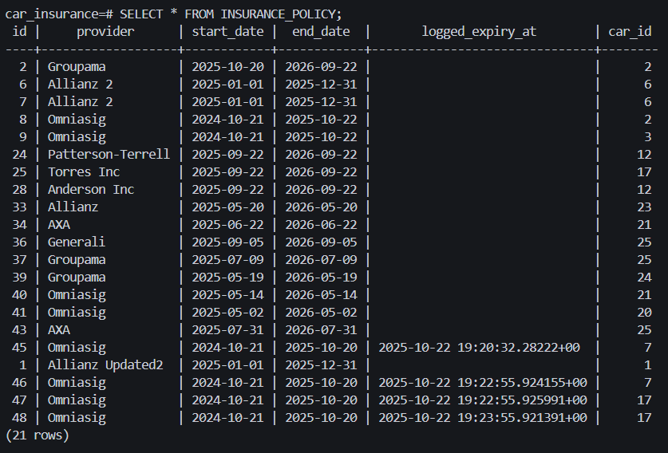
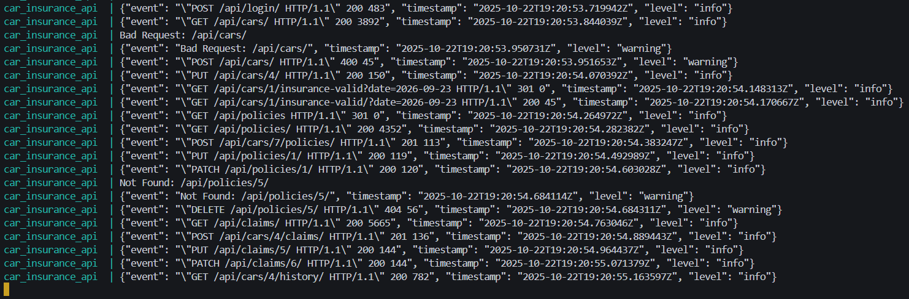
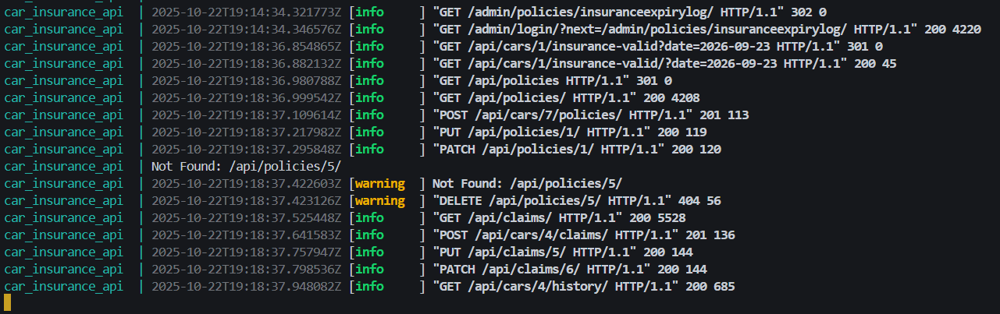
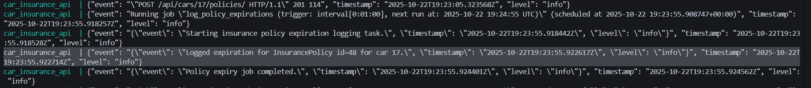

# 🚗 Car Insurance API (Django + Docker)

A modular backend system for managing car insurance data — built with **Django REST Framework**, **PostgreSQL**, **Redis**, and **Docker**.  
It provides endpoints for cars, insurance policies, claims, and history tracking, including background scheduling, structured logging, and automated testing.

---

## 🧱 Architecture Overview

| Layer | Technology |
|-------|-------------|
| **Backend Framework** | Django 5 + Django REST Framework |
| **Database** | PostgreSQL |
| **Cache / Broker** | Redis |
| **Task Scheduling** | APScheduler |
| **Logging** | structlog (JSON logging in production) |
| **Testing** | pytest + pytest-django + coverage |
| **Containerization** | Docker + Docker Compose |
| **Automation** | PowerShell scripts (`scripts/setup/*.ps1`) |

---

## 🗂 Project Structure

```

car_insurance_backend/
├── apps/
│   ├── accounts/               # User registration (Django built-in User)
│   ├── cars/                   # Vehicle management
│   ├── claims/                 # Insurance claims endpoints
│   ├── policies/               # Policies, validity, and expiry tracking
│   └── **init**.py
│
├── core/
│   ├── scheduler.py            # APScheduler background job (policy expiry)
│   ├── management/
│   │   └── commands/
│   │       └── seed.py         # Seed DB with factory_boy + Faker mock data
│   └── apps.py
│
├── car_insurance/
│   ├── settings.py             # Django + structlog configuration
│   ├── urls.py                 # Global API routing
│   └── wsgi.py
│
├── scripts/
│   ├── setup/
│   │   ├── run.ps1             # Start + build full Docker environment
│   │   ├── db.ps1              # Manage migrations / database
│   ├── cleanup.ps1             # Remove containers & volumes
│   ├── seed.ps1                # Seed mock data via Django command
│   └── scheduler.ps1           # Run APScheduler manually (optional)
│
├── Dockerfile
├── docker-compose.yml
├── requirements.txt
├── pytest.ini
├── README.md
└── .env

````

---

## ⚙️ Environment Configuration (`.env`)

```ini
# Security
SECRET_KEY=supersecretkey
DEBUG=True

# Database
POSTGRES_DB=car_insurance
POSTGRES_USER=
POSTGRES_PASSWORD=
POSTGRES_HOST=db
POSTGRES_PORT=5432

# Redis / Cache
REDIS_URL=redis://redis:6379/1

# Time zone
TIME_ZONE=Europe/Bucharest

# Scheduler
SCHEDULER_ENABLED=True

# Logging
ENV=dev
LOG_LEVEL=INFO
````

---

## 🧰 Commands

### 🔧 Setup and Run

```powershell
.\scripts\setup\run.ps1
```

Or manually:

```bash
docker compose up --build
```

**Access Django API:**
👉 [http://localhost:8000](http://localhost:8000)

---

### 🗄️ Database Access

```bash
docker exec -it car_insurance_db psql -U car_admin -d car_insurance
```

Inside psql:

```sql
\dt       -- list tables
SELECT * FROM cars;
```

---

### 🧾 Logs

View live backend logs:

```bash
docker compose logs -f backend
```

**Logging behavior:**

* In **development (ENV=dev)** → human-readable colored console logs.
* In **production (ENV=prod)** → structured JSON logs (machine-readable, ready for observability tools).

---

### 🧩 Django Management Commands

```bash
# Apply migrations
docker compose exec backend python manage.py migrate

# Open Django shell
docker compose exec backend python manage.py shell

# Seed mock data
docker compose exec backend python manage.py seed
```

---

## 🧪 Testing

**Automated Testing:**
Uses `pytest`, `pytest-django`, and `pytest-cov` for integration and coverage tests.
Manual API testing is done with **Postman**.

```bash
# Run all tests
docker compose exec backend pytest -v

# Run tests with coverage
docker compose exec backend pytest --cov=apps --cov-report=term-missing -v
```

---

## 🧰 Factories & Seeding

Mock data is generated using **factory_boy** and **Faker**. Seeder script:

```bash
docker compose exec backend python manage.py seed
```
---

## 🖼️ Application Previews

###  Insurance Policies in PostgreSQL  
A direct SQL view from the **`insurance_policy`** table showing registered policies, start and end dates, and logged expirations.  



---

###  JSON Logging (Production Mode)  
Demonstrates **structured logging** via `structlog`, where logs are output in JSON format. 



---

###  Live Development Logs  
Console output in **development mode (`ENV=dev`)**, showcasing real-time API request tracking and system events.  



---

###  Policy Expiry Scheduler  
Logs generated by the **APScheduler background job**, automatically detecting and updating expired policies in the system.  



---

